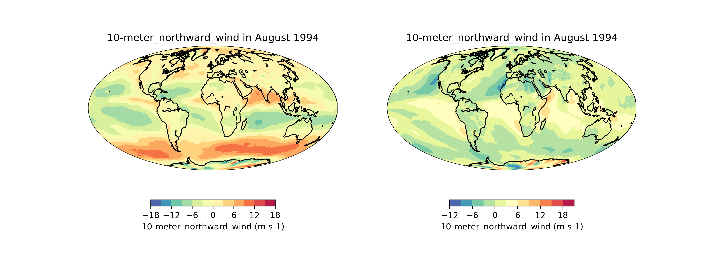
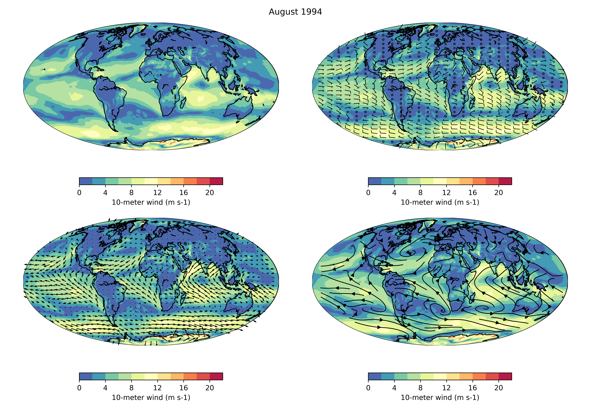

# Access MERRA-2 Data using OPeNDAP with Python

This repo contains files to access MERRA-2 data using OPeNDAP with Python. The data is accessed using `xarray`. The data is visualized using `matplotlib` and `Basemap`.

For example, we download [this file](https://data.gesdisc.earthdata.nasa.gov/data/MERRA2_DIURNAL/M2IUNXASM.5.12.4/1980/MERRA2_100.instU_2d_asm_Nx.198001.nc4
)

## Introduction

## Wind power density

